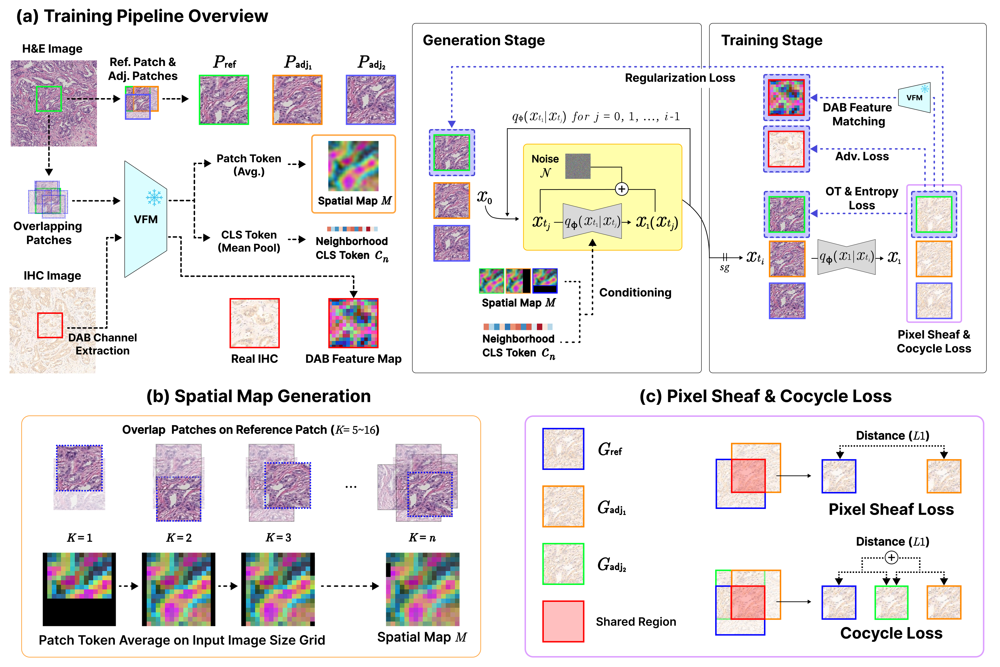

<h1 align="center">SheafStain:<br>Sheaf-Theoretic Schrödinger Bridge for Spatially and Biologically Coherent Virtual Staining</h1>

<p align="center">
  Hyeongyeol Lim<sup>1,2</sup>, Hongjun Yoon<sup>2*</sup>, Eunjin Jang<sup>2</sup>, Daeky Jeong<sup>2</sup>, Won June Cho<sup>2</sup>, Hwamin Lee<sup>1*</sup><br>
  <sup>1</sup>Department of Biomedical Informatics, Korea University College of Medicine&nbsp;&nbsp;<sup>2</sup>DEEPNOID Inc.<br>
  <sup>*</sup>Corresponding authors<br>
  <b>NeurIPS 2026</b>
</p>

<div align="center">
  <a href="https://arxiv.org/abs/2606.11846"></a>&nbsp;
  <a href="https://github.com/deepnoid-ai/SheafStain"></a>&nbsp;
  <a href="https://doodleima.github.io/SheafStain-Patho/"></a>
</div>

<br>



Virtual staining turns routine H&E slides into IHC, which makes biomarker quantification in cancer diagnostics faster and cheaper.
On a gigapixel whole slide the model runs patch by patch, and independent patches fail to preserve spatial continuity, leaving artifacts that mismatch the ground truth. Pathology vision foundation models (VFMs) give rich features but their self-attention ties
each region's embedding to its surrounding context, so the same physical region
receives inconsistent embeddings.
We formalize and validate this 'context
contamination' as a sheaf-theoretic problem: the embeddings form a presheaf whose
sections disagree on overlaps, so no global section restricts to them.

We propose SheafStain, which reinterprets VFM features as sheaf-like sections for
spatially and biologically coherent virtual staining. It integrates the VFM class
and patch tokens into a Schrödinger-bridge generator. The patch tokens form a
per-position spatial map for spatial coherence, and the class token anchors
biological consistency.
An encoder co-pretrained on H&E and IHC yields cross-stain sections, so one VFM feature space supervises both
the input conditioning and the output stain alignment. We evaluate SheafStain on
full 1024x1024 stitched images for BCI (HER2) and MIST (HER2, ER, PR, and Ki-67).

## Requirements

Create an environment and install the pinned dependencies (Python 3.10):

```bash
git clone https://github.com/deepnoid-ai/SheafStain.git
cd SheafStain

conda create -n sheafstain python=3.10 -y
conda activate sheafstain
pip install -r requirements.txt
```

The source code in this repository covers training, inference, and evaluation.

For the VFM pre-trained weights (Prov-GigaPath, UNI, UNI2-h, and Virchow2), you may
request access on their model pages and use them under their own licenses.

## Configuration

`config.yaml` holds the paths and run settings. Fill in the paths below, then run
the scripts in the following sections. Each script reads `config.yaml` by default,
or another config file given as its first argument.

```yaml
vfm_model_path:   /your/path/to/prov-gigapath   # VFM weights directory
dataroot:         /your/path/to/dataset         # dataset root (see Dataset structure)
sheaf_preset_dir: /your/path/to/sheaf_presets   # precomputed presets (training)
```

## Dataset structure

Set `dataroot` to a directory with the following structure:

```
<dataroot>/
  image/psi/he/<stain>/          H&E images
  image/psi/ihc/<stain>/         IHC images (same file names)
  label/psi/<stain>/labels.csv   image_id and split of each image
```

`<stain>` is one of `her2`, `er`, `pr`, `ki67`. The shipped `config.yaml` is set for
MIST (`train_split_mode: mist`, `img_ext: .jpg`). Use `bci` and `.png` for BCI.

## Preprocessing

Precompute the VFM conditioning (presets) before training. Training reads them
from `sheaf_preset_dir`.

```bash
bash script/run_presets.sh
PRESET_START=0 PRESET_END=8 bash script/run_presets.sh   # override the id range
GPUS=0,1 bash script/run_presets.sh                      # override the GPUs
```

The runner splits the preset ids across the GPUs in `gpu_ids`, one process per
GPU, and writes the logs to `sheaf_preset_dir/preset_gpu<id>.log`.

A preset is tied to the VFM and the dataset it was built from. Keep `vfm_name`,
`vfm_embed_dim`, `dataroot`, `stain`, `img_ext`, and `train_split_mode` the same
for training, and use a separate `sheaf_preset_dir` for each VFM (`vfm_embed_dim`:
1536 for Prov-GigaPath and UNI2-h, 1024 for UNI, 1280 for Virchow2).

## Training

```bash
bash script/run_train.sh              # single GPU
NGPU=8 bash script/run_train.sh       # 8 GPUs with torchrun, as in the paper
```

All training settings come from `config.yaml`. `batch_size` is per GPU. The paper
uses 8 GPUs with a batch of 24 each (192 in total). Checkpoints are written to
`<checkpoints_dir>/<name>/`.

Weights & Biases logging is off by default. To turn it on, set `use_wandb: true`
and provide the key through `WANDB_API_KEY`, `wandb_api_key_file`, or `wandb login`.

## Inference

```bash
bash script/run_inference.sh                           # reads config.yaml
GPUS=0,1,2,3 bash script/run_inference.sh              # override the GPUs
bash script/run_inference.sh config.yaml --epoch 300   # extra flags override
```

Stitched 1024x1024 IHC images are written to
`<results_dir>/<name>/test_<epoch>_new/stitched/`. The runner splits the test
images across the GPUs in `gpu_ids`, one process per GPU, and writes the logs next
to `stitched/`.

## Evaluation

```bash
bash script/run_eval.sh                                     # derives paths from config.yaml
PRED_DIR=<generated> GT_DIR=<ihc> bash script/run_eval.sh   # override the derived dirs
```

The runner takes `epoch` from `config.yaml`, so set it to the checkpoint you ran
inference with. `eval_quantitative.py` writes `quant_<name>.csv` with the metrics
reported in the paper: FID, KID, LPIPS, DISTS, PSNR, SSIM, TS, DAB-r, DAB-KL,
DAB-JSD, and the mIOD and FOD errors. `eval_biological.py` writes `bio_<name>.csv`
with additional DAB statistics. Both files go to
`<results_dir>/<name>/test_<epoch>_new/`. Set `OUT_DIR` to write them elsewhere.

## Citation

```bibtex
@inproceedings{lim2026sheafstain,
  title     = {SheafStain: Sheaf-Theoretic Schr\"odinger Bridge for Spatially and Biologically Coherent Virtual Staining},
  author    = {Lim, Hyeongyeol and Yoon, Hongjun and Jang, Eunjin and Jeong, Daeky and Cho, Won June and Lee, Hwamin},
  booktitle = {The Fortieth Annual Conference on Neural Information Processing Systems},
  year      = {2026},
  url       = {https://arxiv.org/abs/2606.11846}
}
```

## License

The code and documentation are under CC BY-NC-SA 4.0 (see `LICENSE`): share and
adapt for non-commercial use, with attribution, under the same license. Code
carried over from the projects below stays under its original license. The
network files carried over from UNSB (`models/ncsn_networks.py`,
`models/stylegan_networks.py`) name their sources in their headers.

- [UNSB](https://github.com/cyclomon/UNSB): The Schrödinger-bridge model, the time-conditioned generator and discriminator, the training loop, and the sampler.
- [CUT](https://github.com/taesungp/contrastive-unpaired-translation): The generator and discriminator networks and the PatchNCE loss.
- [UNIStainNet](https://github.com/facevoid/UNIStainNet): The DAB extraction and the DAB intensity and Fourier edge losses.

## Acknowledgments

This work was supported by the Technology Innovation Program
(RS-2025-02221011, Development of Medical-Specialized Multimodal Hyperscale Generative AI Technology for Global Integration)
funded by the Ministry of Trade Industry & Energy (MOTIE, South Korea).
